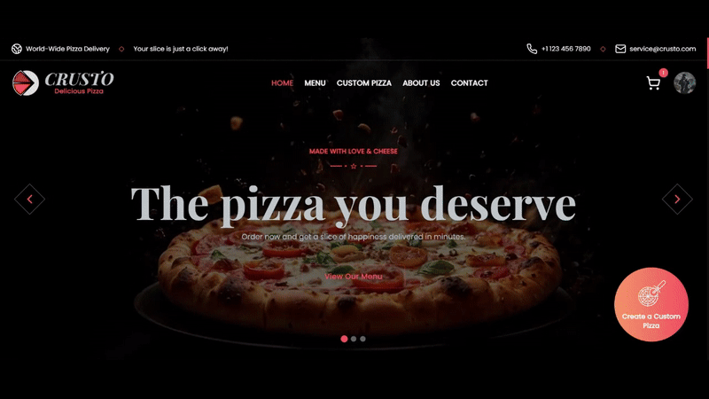

<h1 align="center" style>
  <br>
  <a href="https://crusto-pizza.vercel.app" target="_blank"></a>
  <br>
  Crusto
  <br>
</h1>

<h4 align="center">
  Full-stack pizza delivery platform with custom pizza building, order tracking, inventory management, and an advanced admin dashboard.
</h4>

<p align="center">
  <a href="" target="_blank">
      
  </a>
  <a href="https://choosealicense.com/licenses/apache" target="_blank">
      
  </a>
  <a href="" target="_blank">
      
  </a>
  <a href="" target="_blank">
    
  </a>
</p>

<p align="center">
  <a href="#key-features">Key Features</a> •
  <a href="#how-to-use">How To Use</a> •
  <a href="#how-to-contribute">How To Contribute</a> •
  <a href="#technologies">Technologies</a> •
  <a href="#license">License</a>
</p>

<p align="center">
  
</p>

🌐 **Live Demo**🔗 [crusto-pizza.vercel.app](https://crusto-pizza.vercel.app)

**Admin Credentials**

```
> Email: admin@gmail.com
> Password: Admin@123
```

## Key Features

- Custom Pizza Builder - Choose ingredients and build pizzas

- Order Tracking - Real-time status updates

- User Accounts - Save preferences and history

- Secure Payments - Multiple payment options

- Admin Dashboard - Manage inventory and orders

- Low Stock Alerts - Email notifications for low ingredients

- Analytics - Sales reports and insights

- Dynamic Pricing - Auto-calculate costs and availability

- Mobile Responsive - Works on all devices

## Project Structure

```
crusto-pizza-delivery-app/
├── client/                     # React frontend application
│   ├── public/                 # Static assets (favicon, etc.)
│   ├── src/
│   │   ├── components/         # Reusable UI components
│   │   ├── hooks/              # Custom React hooks
│   │   ├── layouts/            # Page layout components (Root, Auth, Dashboard)
│   │   ├── lib/                # Utility functions and helpers
│   │   ├── pages/              # Page components organized by domain
│   │   │   ├── auth/           # Authentication pages
│   │   │   ├── root/           # Customer-facing pages
│   │   │   └── dashboard/      # Admin dashboard pages
│   │   ├── routes/             # React Router configuration
│   │   ├── store/              # Zustand state management stores
│   │   ├── App.tsx             # Main app component
│   │   ├── main.tsx            # React entry point
│   │   └── global.css          # Global styles
│   ├── .env.example            # Environment variables template
│   ├── package.json            # Frontend dependencies and scripts
│   ├── components.json         # Radix UI components configuration
│   ├── vite.config.ts          # Vite build configuration
│   └── tsconfig.json           # TypeScript configuration
│
├── server/                     # Node.js backend application
│   ├── src/
│   │   ├── config/             # Configuration files (DB, Redis, Cloudinary, Razorpay)
│   │   ├── controllers/        # Route handlers and business logic
│   │   ├── jobs/               # Background job system (BullMQ)
│   │   │   ├── processors/     # Job processing logic
│   │   │   ├── queues/         # Job queue definitions
│   │   │   └── workers/        # Worker processes (price, availability)
│   │   ├── middleware/         # Express middleware (auth, upload, etc.)
│   │   ├── models/             # Mongoose schemas and models
│   │   ├── nodemailer/         # Email configuration and templates
│   │   ├── routes/             # API route definitions
│   │   ├── types/              # TypeScript type definitions
│   │   ├── utils/              # Helper functions and utilities
│   │   └── server.ts           # Express server entry point
│   ├── .env.example            # Environment variables template
│   ├── package.json            # Backend dependencies and scripts
│   └── tsconfig.json           # TypeScript configuration
├── .gitignore                  # Git ignore rules
├── LICENSE                     # Apache 2.0 license
└── README.md                   # Project documentation
```

## How To Use

To clone and run this application, you'll need [Git](https://git-scm.com) and [Node.js](https://nodejs.org/en/download) (which comes with [npm](http://npmjs.com)) installed on your computer. From your command line:

##### Clone this repository

```bash
$ git clone https://github.com/kunaldasx/crusto-pizza-delivery-app
$ cd crusto-pizza-delivery-app
```

##### Frontend setup (Terminal 1)

```bash
$ cd client
$ npm install
$ cp .env.example .env # Configure variables
$ npm run dev
```

##### Backend setup (Terminal 2)

```bash
$ cd server
$ npm install
$ cp .env.example .env  # Configure variables
$ npm run dev
```

##### Background Workers setup

```bash
# Terminal 3
$ cd server
$ npm run dev:price        # Price calculations

# Terminal 4
$ cd server
$ npm run dev:availability # Stock management
```

## How to Contribute

1. Clone repo and create a new branch: `$ https://github.com/kunaldasx/crusto-pizza-delivery-app -b name_for_new_branch`.
2. Make changes and test
3. Submit Pull Request with comprehensive description of changes

## Emailware

Crusto is an [emailware](https://en.wiktionary.org/wiki/emailware). Meaning, if you liked using this app or it has helped you in any way, I'd like you send me an email at <kunaldasx@gmail.com> about anything you'd want to say about this software. I'd really appreciate it!

## Technologies

This software uses the following technologies:

- **Frontend**: React 19 + TypeScript + Vite + TailwindCSS + Radix UI
- **Backend**: Node.js + Express + TypeScript
- **Database**: MongoDB (Mongoose ODM)
- **State Management**: Zustand stores
- **Queue System**: Redis + BullMQ for background jobs
- **Authentication**: JWT + bcrypt
- **File Storage**: Cloudinary
- **Payments**: Razorpay
- **Email**: Nodemailer

## Support

If you like this project and think it has helped in any way, consider buying me a coffee!

<a href="" target="_blank"></a>

## License

Apache 2.0

---

> 🌐 [Visit my website →](https://kunaldasx.vercel.app/)<br>
> 🖥️ [GitHub](https://github.com/kunaldasx) &nbsp;&middot;&nbsp;
> 💼 [LinkedIn](https://www.linkedin.com/in/kunaldasx/) &nbsp;&middot;&nbsp;
> 🐦 [Twitter / X](https://x.com/Kunaldasx) &nbsp;&middot;&nbsp;
